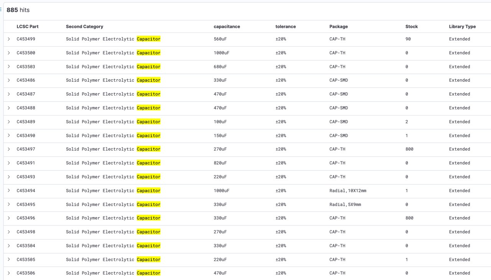
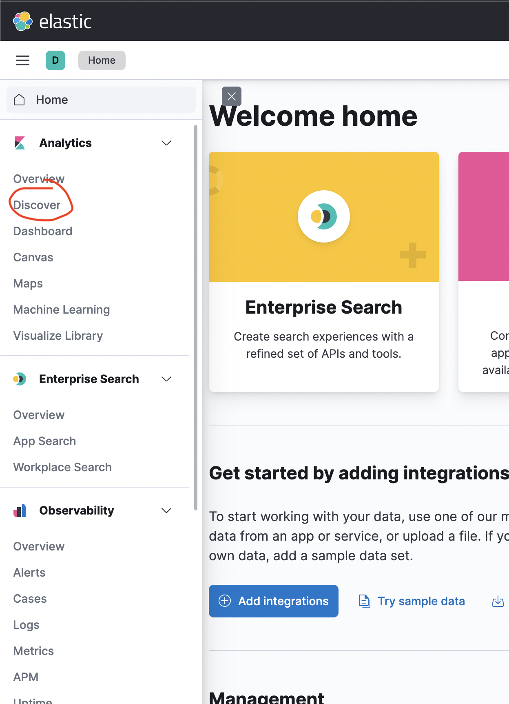
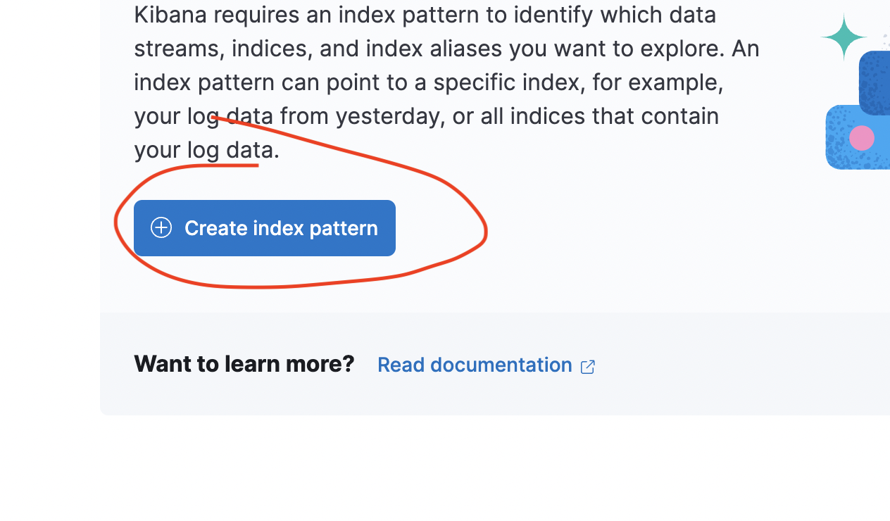

#Index in elasticsearch JLCPCB parts


## Description
This project is docker-based, on first run will download and index CSV 
with parts and then every night at 01:00 UTC will pull list of parts 
and update them.

## Running
### Prerequisites
- docker
- docker-compose

### To start everything
Simply run 
```shell
docker-compose up -d 
```

Then after few minutes when logstash finishes with initial file you 
need to go to grafana `localhost:5601`. There you need to 
set up index pattern.

Go to hamburger menu and to discover part


Now to create new index pattern


let's catch our index called `jlc` and use timestamp


After that simply go back to discover card 


And you can search!