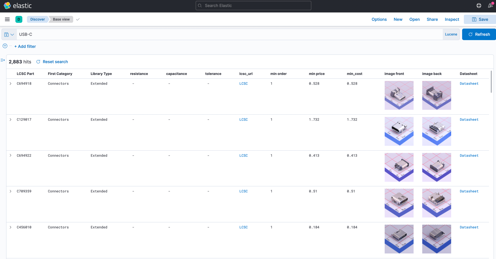

# Elasticsearch with JLCPCB parts!



## Description
This project is docker-based, on first run will download and index CSV 
with parts and then every night at 01:00 UTC will pull list of parts 
and update them.

## Running
### Prerequisites
- docker
- docker-compose

### To start everything
Startup kibana and logstash:
```shell
docker-compose up -d 
```
Then go to http://localhost:5601 and wait until kibana is ready.
Now start filling up data:
```shell
docker-compose --profile logstash up -d
```

And setup kibana:
```shell
docker-compose --profile setup_kibana up -d
```

After that simply go to:
http://localhost:5601/app/discover#/view/388e1160-835b-11ec-993e-6baad04d7244
And search!
